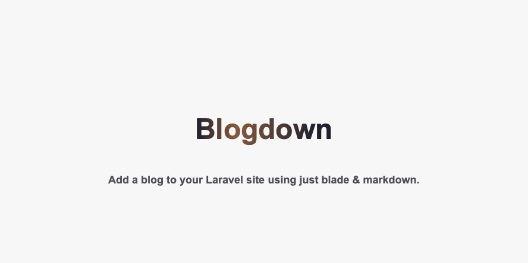

## Install

You can install the package via composer:

```bash
# Require it as a dependency
composer require swiftmade/blogdown

# Publish the config file
php artisan vendor:publish --provider "Swiftmade\Blogdown\BlogdownProvider"
```

Go to `config/blogdown.php` to configure authors (example included in the file).

## Post generator

Simply run this command to make a new article:

```bash
php artisan blog:new
```

Follow the instructions, and you'll have your first blog post ready in seconds.

## Anatomy of a post

Each post consists of a meta section (mandatory) and the content. You can use Markdown to enrich your post's format.

To use markdown inside blade, simply invoke `@markdown` / `@endmarkdown`. Or, you can also add `.md` extension before `.blade.php` and skip the markdown calls.

```blade
{{--
title: Hello World!
tags: blog, first post
date: 18.03.2020
--}}
Use blade to compose post content.

@markdown
**Or even use markdown** if you want.

### Isn't that great?
@endmarkdown
```

## Draft vs Published

Let's say you're working on a long post and it's not production ready yet. Just do this:

```blade
{{--
... other attributes
draft: true
--}}

... Your awesome content ...
```

Since you added the `draft` meta attribute, this post will be hidden in `production` environments.

## Meta Attributes are Dynamic

You can declare as many meta attributes as you want.

```blade
{{--
random_attribute: 51231
--}}
```

You can access your post's meta attributes like so:

```php
$post->random_attribute; // 51231
```

## Force Clear Cache

> php artisan blog:index

## Customizing Blogdown

You can change most things about Blogdown. To get started, publish the config:

```bash
php artisan vendor:publish  --provider "Swiftmade\Blogdown\BlogdownProvider"
```

**Things you can customize**

- Override views to change how your blog looks
- Add list of authors to quickly load author meta
- Format and content of post slugs
- Enable/disable default routes.
- Change date format.
- And probably more...

## Format and content of post slugs

By default, this is how a post's slug is built:

```php
public function slug()
{
    return Str::slug($this->view_name);
}
```

If needed, you can override the `Post` model and build a better slug:

```php
public function slug()
{
    return Str::slug($this->date->format('Y-m-d') . ' ' . $this->title);
}
```

Don't forget to register your custom `Post` model in `config/blogdown.php`!

## Pull Requests Are Welcome

If you want to see more features or report bugs feel free to open issues and send pull requests.

**Contributors:**

- [@aozisik](https://github.com/aozisik)
- [@BenSampo](https://github.com/BenSampo)
